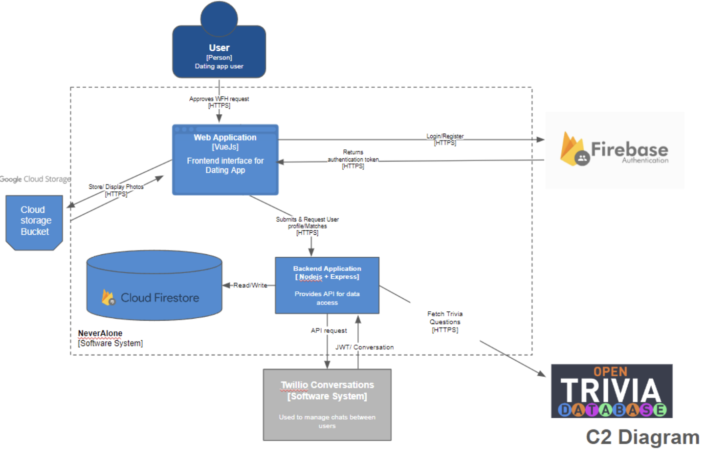
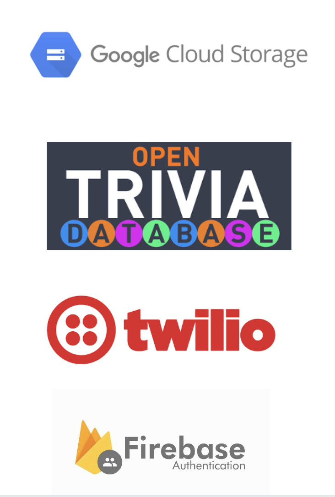

# NeverAlone

Welcome to the **NeverAlone** GitHub repository! This project is a socially-focused dating application designed to foster deeper, meaningful connections, moving away from surface-level interactions to combat the loneliness epidemic often exacerbated by dating apps.

## Project Overview

The app aims to address common user pain points, such as shallow conversations, cluttered interfaces, and limited interaction opportunities. Our solution combines intuitive design, enhanced filters, engaging quiz games, and options that go beyond traditional dating to create genuine connections.

## Installation

Install NeverAlone with npm <br>
Open 2 terminals

```bash
  cd Backend
  npm i
  npm run start
```

```bash
  cd Frontned
  npm i
  npm run dev
```
    
## Key Features

- **Chat Functionality**: Enables users to engage in real-time conversations with their personal matches.
- **Enhanced Filters and Options**: Provides granular filters allowing users to specify what they are looking for, whether friendship or romance, and select partners based on shared values and interests.
- **Quiz Games**: Includes interactive quiz games to help users learn more about their matches in a fun, engaging way.
- **Compatibility Focus (Love is Blind)**: Emphasizes compatibility and shared values, moving beyond superficial traits.

## Solution Architecture



### Frontend


### Backend


## APIs

- **Google Cloud Storage**: Cloud Storage of Images
- **Open Trivia Database**: Provides database of trivia questions
- **Twilio**: Supports real-time chat and notifications.
- **Firebase Auth**: User authentication for creating accounts and logging in



## Beyond the Lab


## Contributors

**G4 Team 15**

<div align="center">
    <table>
        <tr>
            <th>Zara</th>
            <th>Nathaniel</th>
            <th>Kendrick</th>
            <th>Xinyi</th>
            <th>Farrell</th>
        </tr>
        <tr>

        </tr>
    </table>
</div>

---
